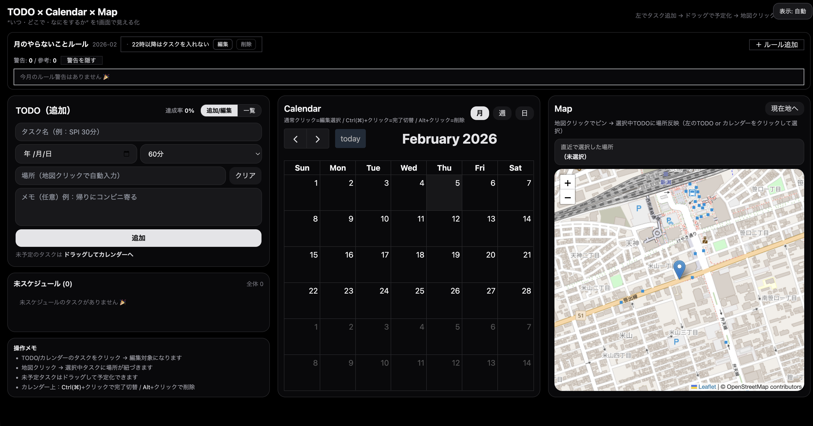

# TODO × Calendar × Map

タスクを **「いつ（カレンダー）・どこで（地図）・なにをする（TODO）」** まで、1画面で整理できる Web アプリです。  
就活ポートフォリオとして「状態管理」「ドラッグ&ドロップ」「地図連携」「APIルート」をまとめて実装しました。

---

## Demo / Repository

- Demo: `https://todo-calendar-map.vercel.app`
- Repository: `https://github.com/ABmilin/todo-calendar-map`
> ※ デモはブラウザごとの `localStorage` を使用します（サーバ保存はしません）。  
> ※ 位置情報（現在地）はブラウザの許可が必要です。

## Screenshots


---

## Features

- ✅ TODO 作成 / 編集 / 削除 / 完了切替
- ✅ 未スケジュール → カレンダーへドラッグして「予定化」
- ✅ 予定のドラッグ移動 / 伸縮で時間変更
- ✅ 地図クリックでタスクに場所（緯度経度 + 表示名）を紐付け
- ✅ 逆ジオコーディングで場所名を取得（※外部API利用）
- ✅ localStorage 永続化（ページ更新しても保持）

---

## UI（PC / スマホ）

### PC（Desktop）
3カラムで **TODO / Calendar / Map** を同時表示します。

### スマホ（Mobile）
- **横画面（landscape）**：TODO / Calendar / Map を **3ペイン同時表示**
- **縦画面（portrait）**：横画面を案内（※仕様をシンプルに保つため）

### 表示モード切替（右上）
右上ボタンで表示モードを切り替えできます：

- 自動（画面幅に応じて自動切替）
- PC
- スマホ

---

## How to Use（使い方）

### 1) タスク追加（左）
1. 左のフォームでタスクを追加します（期限・所要時間・メモは任意）
2. 追加したタスクは「未スケジュール」に出ます

### 2) 予定化（カレンダーへドラッグ）
- 「未スケジュール」のタスクを、カレンダーへドラッグして予定化します

### 3) 場所の紐付け（地図クリック）
1. TODO またはカレンダーのタスクをクリックして **選択**
2. 地図をクリック → 選択中タスクに場所が紐づきます  
   ※「現在地へ」ボタンで現在地表示もできます（ブラウザ許可が必要）

---

## Calendar 操作

- 通常クリック：編集対象として選択
- Ctrl(⌘) + クリック：完了/未完了の切替
- Alt + クリック：削除（確認あり）

---

## Tech Stack

- Next.js (App Router) / TypeScript
- Zustand（状態管理）
- FullCalendar（ドラッグ & ドロップの予定管理）
- Leaflet + react-leaflet（地図表示）
- Tailwind CSS

---

## Data & Privacy

- タスクは **ブラウザの localStorage** に保存します（サーバへは保存しません）
- 位置情報（現在地表示）は **ブラウザ許可制** です
- 逆ジオコーディング（場所名取得）のみ、サーバ側のAPI経由で外部サービスを呼び出します（下記参照）

---

## Third-party Services / Notes（重要）

### OpenStreetMap Tiles
本アプリの地図タイルは **OpenStreetMap の公開タイルサーバ** を使用しています。  
公開タイルは **best-effort（SLAなし）** で提供され、アクセスが集中するなど「重い利用」ではブロックされる可能性があります。  
ポートフォリオ用途（少量アクセス）を想定しています。

### Reverse Geocoding (Nominatim)
地図クリック時の場所名取得に **Nominatim（OpenStreetMap）** を利用しています。

- 利用ポリシー上、**大量アクセスは禁止**で、目安として **最大 1 request/sec** が要求されています
- また、**識別可能な User-Agent または Referer** の送信が要求されています
- 本アプリでは API Route 側で簡易スロットルを入れ、User-Agent を付与しています

> もし公開デモが想定以上にアクセスされる場合は、Nominatim 以外の商用プロバイダ利用や自前運用などへの切り替えが必要になります。

---

## Setup（ローカル実行）

```bash
npm install
npm run dev